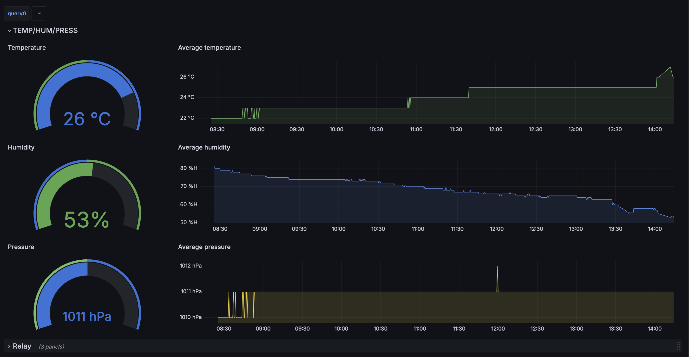
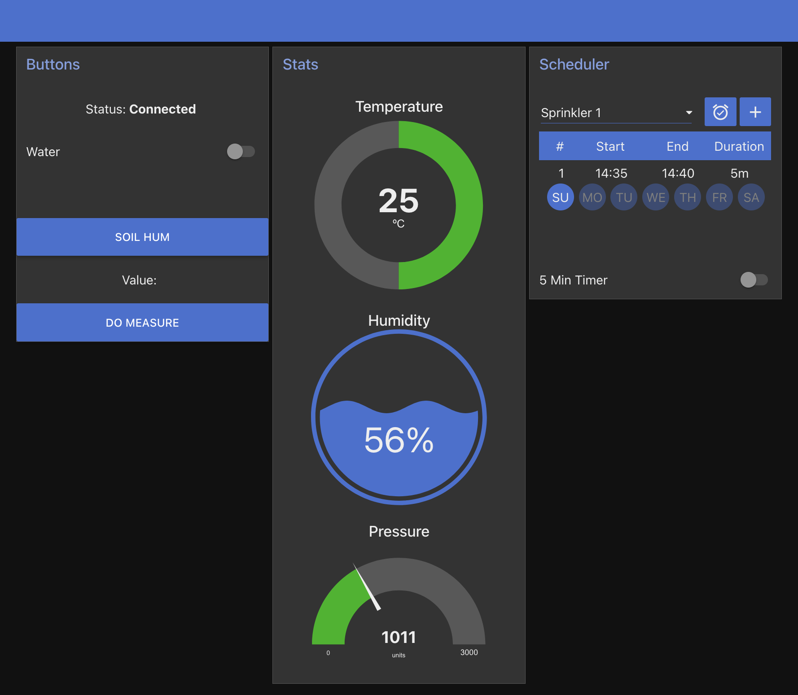

**Feed My Plant** is a smart watering system that ensures your little plants stay hydrated at all times based on environmental conditions without needing your intervention! This project is the result of a collaborative effort and was develop during the innovation week 2024 organised by Critical software.

## Table of Contents
1. [Project Overview](#project-overview)
2. [How It Works](#how-it-works)
3. [Hardware Requirements](#hardware-requirements)
4. [Software Setup](#software-setup)
    - [Prerequisites](#prerequisites)
    - [Installation](#installation)
5. [Usage](#usage)
6. [Docker Compose Services](#docker-compose-services)
    - [Telegraf](#telegraf)
    - [InfluxDB](#influxdb)
    - [Grafana](#grafana)
    - [Node-RED](#node-red)
    - [Mosquitto](#mosquitto)
7. [Contributing](#contributing)
8. [License](#license)

## Project Overview

**Feed My Plant** automates the watering process for your plants, ensuring they receive the right amount of water based on various environmental factors. The system uses sensors to monitor rain and ambient conditions, triggering the watering process as needed.

## How It Works

The system consists of several interconnected services running in Docker containers:
- **Mosquitto** acts as an MQTT broker for communication between components (esp32 and docker network).
- **Node-RED** manages the logic and workflows.
- **Telegraf** consume mqtt message and send it to the database.
- **InfluxDB** stores the collected data.
- **Grafana** provides a dashboard for visualizing the data.

## Hardware Requirements

To set up the **Feed My Plant** system, you will need the following hardware:
- An ESP32
- BME680, rain detector
- Electrovalve
- 12 volts relay
- 12 volts transformator
- Tubing and connectors

## Software Setup

### Prerequisites

Before setting up the software, ensure you have the following installed on your machine:
- [Docker](https://docs.docker.com/get-docker/)
- [Docker Compose](https://docs.docker.com/compose/install/)
- [PlateformIO](https://docs.platformio.org/en/latest/core/installation/index.html)

### Installation

1. **Clone the Repository**:
    ```sh
    git clone https://github.com/yourusername/feed-my-plant.git
    cd feed-my-plant
    ```
2. Upload the code to the board
```shell
	cd code
	pio run --target upload && pio device monitor
```
3. **Start the Docker Containers**:
    ```sh
	cd docker_compose
    docker-compose up -d

4. **Set up your database**

	- Go to your database page (`http://localhost:8086`)
	- Create a profile and copy your API token  
<br>

4. **Modify credentials**:

    - Make sure to modify environment variable in the .env file with the value you just entered when creating your influxdb user.  
<br>

5. **Restart your services**
```shell
	docker-compose restart
```

## Usage


Once the Docker containers are up and running:
1. Access **Grafana** at `http://localhost:3000` to visualize sensor data.
2. Access **Node-RED** at `http://localhost:1880` to manage and customize the automation workflows. Access the **Node-RED** UI at `http://localhost:1880/ui` to interact with your microcontroller.
3. Ensure **Telegraf**, **InfluxDB**, and **Mosquitto** are running and properly configured to collect and route data from your sensors.

<div style="display: flex; justify-content: space-between;">
    
    
</div>

## Docker Compose Services

### Telegraf

- **Image**: `telegraf`
- **Ports**: `8125`
- **Configuration**:
    ```yaml
    volumes:
      - ./data/telegraf/telegraf.conf:/etc/telegraf/telegraf.conf:ro
    ```

### InfluxDB

- **Image**: `influxdb`
- **Ports**: `8086`
- **Volumes**:
    ```yaml
    volumes:
      - influxdb_data:/var/lib/influxdb
    ```

### Grafana

- **Image**: `grafana/grafana`
- **Ports**: `3000`
- **Volumes**:
    ```yaml
    volumes:
      - grafana_data:/var/lib/grafana
    ```

### Node-RED

- **Image**: `nodered/node-red:latest`
- **Container Name**: `node-red`
- **Ports**: `1880`
- **Volumes**:
    ```yaml
    volumes:
      - ./data/node-red:/data
    ```

### Mosquitto

- **Image**: `eclipse-mosquitto:latest`
- **Container Name**: `mosquitto`
- **Ports**: `1883`
- **Volumes**:
    ```yaml
    volumes:
      - ./data/mosquitto/config:/mosquitto/config
      - ./data/mosquitto/data:/mosquitto/data
      - ./data/mosquitto/log:/mosquitto/log
    ```

## License

This project is licensed under the [MIT License](LICENSE).
